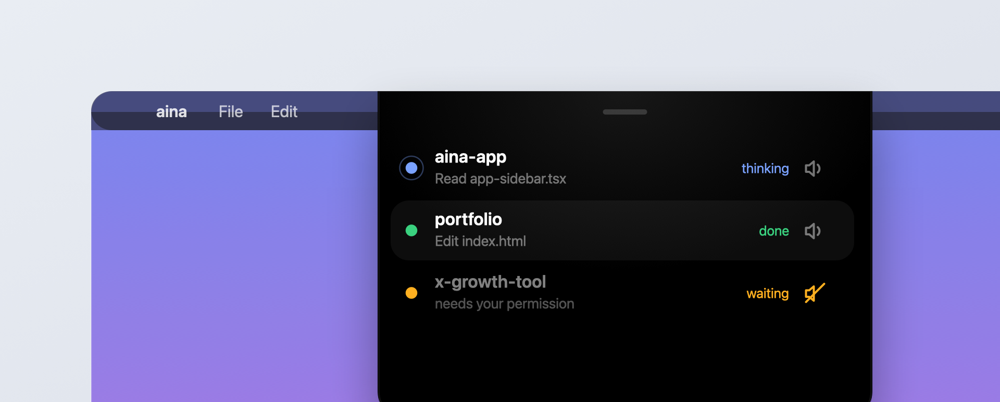

# 🪺 Roost

**Your Claude Code sessions, watched from the notch.** A tiny native macOS app that lives in the notch, shows every running Claude Code session at a glance, chimes when one finishes, and jumps you straight to the right terminal tab.



> **Install the native app (this is v2).** Roost is now a real Swift/AppKit `.app` — the [Install](#install) steps below are the only ones you need. The earlier Hammerspoon prototype has been **retired**; it's kept in [`legacy/`](legacy/) for posterity, not for use. Don't install it. ([why](#legacy-the-original-hammerspoon-prototype))

---

## The pain point

I run a *lot* of Claude Code sessions at once, spread across iTerm2 tabs and windows. Two things kept biting me:

1. **I'd miss when a session finished.** It would go quiet waiting for me while I was heads-down in another tab, and I wouldn't notice for minutes.
2. **I'd click the wrong one.** With a dozen near-identical terminal tabs, finding *which* session just needed me was a guessing game.

I wanted something ambient: a single place, always in view, that tells me what every session is doing and nudges me the moment one needs me, without me having to go looking. The notch is dead space at the top of every modern MacBook, so I put it to work.

## What Roost does

- **One glance, every session.** Hover the notch and the panel grows out of it. Each row shows a live status — `thinking`, `waiting`, or `done` — plus the current action (e.g. "Read app-sidebar.tsx"). The whole panel is the hover zone: it stays open while your cursor is on it and snaps back when you leave.
- **It grows out of the notch.** Open and close are a real spring animation — the panel expands from a notch-sized sliver into the full UI and collapses back into it. The top strip is absolute black so it fuses with the physical notch; the body below is real frosted glass.
- **It comes to you.** When a session finishes, the panel drops for a few seconds and plays a short metallic chime — boosted if music or a video is already playing, so it cuts through.
- **Your names, not folders.** Roost shows each session's **iTerm2 tab name** (the name Claude Code sets, e.g. "MYPROJ", "Aina Main"), falling back to the folder name only when a tab has none.
- **Click to teleport.** Click a session and Roost focuses that exact iTerm2 tab — no more hunting.
- **Per-session mute.** Each row has its own bell. Silence a chatty session without muting the rest.
- **Refresh clears the noise.** The reload button wipes every finished row; they stay gone until a *new* completion comes in.
- **Scales to a busy day.** The list caps at 10 rows and scrolls beyond that, so it never runs off the screen.
- **Never gets stuck.** Statuses self-correct (an idle "waiting for input" ping is never mistaken for a real prompt), and dormant sessions drop off on their own.
- **Menu bar fallback.** A menu bar item shows live counts and the full list, in case you want it without the notch.

Status is real, not guessed: green = done and waiting for you, amber = blocked on your input or a permission, blue = actively thinking.

## How it works

Two small layers, no server, no daemon of its own:

```
Claude Code hooks ──▶ reporter (python) ──▶ ~/.claude-notch/state/*.json ──▶ Roost.app (Swift/AppKit)
  Stop / Notification /     writes one json per        one file per session          watches the folder, draws the
  PreToolUse / etc.         session; plays the chime    (status + last action)        notch panel + menu bar
```

1. **Reporter.** Claude Code fires lifecycle [hooks](hooks/settings.snippet.json). A tiny python script (`bin/notch-hook.py`) turns each event into a status, writes it to a per-session JSON file, and on `done` / a real prompt plays a synthesized metallic chime (unless that session is muted). The notch panel + chime *are* the notification — no macOS banners.
2. **UI.** `Roost.app` is a native menu-bar agent (`NSStatusItem` + a borderless `NSPanel` at pop-up-menu level, SwiftUI content). It watches the state folder and renders the panel with a real `NSVisualEffectView` glass backdrop, the notch-shouldered shape, and math-driven status indicators. Clicks drive AppleScript to focus the right iTerm2 session by its unique id.

The top of the panel is absolute black on purpose: it fuses with the physical notch and hides it, so it reads as the notch *growing* downward rather than a floating window.

## Terminal support

Roost is driven by Claude Code hooks, not by scraping any particular terminal, so the core works in **any terminal**: Terminal.app, iTerm2, the VS Code integrated terminal, Ghostty, Warp, and so on.

| | iTerm2 | Terminal.app | others |
|---|---|---|---|
| Live status, chime, auto-drop, menu-bar count | yes | yes | yes |
| Session name | your tab name | folder name | folder name |
| Click a row to jump to its tab | yes (`unique id`) | yes (by `tty`) | raises the app |

Click-to-jump dispatches on which terminal the session runs in: iTerm2 by its `unique id`, Terminal.app by the tab's `tty` (the reporter records it via `ps`, since that's the stable per-tab id Terminal.app exposes), and any other terminal is just brought to the front (no per-tab focus yet). Wiring up a new terminal is the same recipe: a stable per-tab id plus an AppleScript focus path. Contributions welcome.

## Install

**Requirements:** macOS 13+, the Xcode **Command Line Tools** (`xcode-select --install` — no full Xcode needed), Python 3 (ships with macOS), and [Claude Code](https://claude.com/claude-code). [iTerm2](https://iterm2.com) is recommended but optional; any terminal works with reduced features (see [Terminal support](#terminal-support)). A notch is nice but not required — the panel just drops from the top center.

```bash
git clone https://github.com/raktimrajkalita/roost.git
cd roost
./install.sh                 # copies the reporter + chimes into ~/.claude-notch/, prints the hook snippet
./build-app.sh --install     # builds Roost.app, installs to /Applications, starts it at login
```

Then add the hooks from [`hooks/settings.snippet.json`](hooks/settings.snippet.json) into your `~/.claude/settings.json` (merge into any existing `"hooks"` block — `./install.sh` prints the exact snippet). **New Claude Code sessions report automatically; restart open ones to pick up the hooks.**

First time you click a session, macOS asks to let Roost control iTerm2 — allow it once and click-to-focus works forever after.

### Just want to run it, not install it

```bash
swift run                    # debug build, runs in the foreground (Ctrl-C to quit)
# or
swift build && ./.build/debug/Roost
```

`ROOST_PREVIEW=<seconds> ./.build/debug/Roost` holds the panel open at launch so you can see it (default 3s).

## Sharing Roost.app with someone else

The build is **ad-hoc signed**, which runs perfectly on *your* Mac but is not notarized, so another Mac's Gatekeeper will warn on first open. Notarization needs a paid Apple Developer account ($99/yr); until then, any of these work for free:

1. **Right-click → Open** on first launch — one "open anyway?" prompt, then it's trusted forever.
2. **Strip the quarantine flag** after download: `xattr -dr com.apple.quarantine Roost.app`.
3. **Build it locally** — clone the repo and run `./build-app.sh`. A locally built app carries no quarantine flag, so there's no warning at all.

## Building the bundle

`./build-app.sh` (Command Line Tools only, no Xcode) does the whole thing:

- `swift build -c release`
- rebuilds `icon/Roost.icns` from `icon/roost.png` if missing (full-bleed + macOS squircle)
- assembles `dist/Roost.app` (Info.plist with `LSUIElement` + the Automation usage string, the icon, `PkgInfo`)
- ad-hoc code-signs it

Add `--install` to also copy it to `/Applications` and register a login item at `~/Library/LaunchAgents/com.raktim.roost.plist`.

**Remove the login item:** `launchctl unload ~/Library/LaunchAgents/com.raktim.roost.plist && rm ~/Library/LaunchAgents/com.raktim.roost.plist`

## Legacy: the original Hammerspoon prototype

Roost started life as a Hammerspoon (`hs.webview`) panel. That version is **retired**: the native `Roost.app` above replaces it and is the only one you should install. The old code stays in [`legacy/hammerspoon/`](legacy/hammerspoon/) and in the git history for posterity. It's the same idea in a heavier engine that needed Hammerspoon installed and used CSS blur instead of real glass.

<details>
<summary>Running the retired version anyway (not recommended)</summary>

It reads the same `~/.claude-notch/state` folder, so with the reporter installed:

```bash
brew install --cask hammerspoon
cp legacy/hammerspoon/init.lua ~/.hammerspoon/init.lua
open -a Hammerspoon
```
</details>

## Project layout

```
Sources/Roost/            the native app
  main.swift              NSApplication (accessory / menu-bar agent)
  AppController.swift     menu bar NSStatusItem + wiring
  SessionStore.swift      reads/normalizes ~/.claude-notch/state, mute flags, iTerm names
  NotchController.swift    NSPanel, real notch geometry, hover + grow/collapse spring
  NotchView.swift         SwiftUI: the notch-shouldered glass panel, rows, indicators
  ITerm.swift             AppleScript: tab names + focus-by-id
Package.swift             SwiftPM (builds with Command Line Tools; opens in Xcode too)
build-app.sh              build/sign/install the .app
packaging/Info.plist      bundle metadata
icon/                     roost.png source + png-to-icns.swift + Roost.icns
bin/                      the reporter (notch-hook.py) + gen-sounds.py  (shared)
sounds/                   synthesized chimes (done.wav, waiting.wav)     (shared)
hooks/                    the Claude Code hook snippet                    (shared)
legacy/hammerspoon/       the retired original prototype (do not install)
```

## Uninstall

```bash
launchctl unload ~/Library/LaunchAgents/com.raktim.roost.plist 2>/dev/null; rm -f ~/Library/LaunchAgents/com.raktim.roost.plist
pkill -x Roost; rm -rf /Applications/Roost.app
rm -rf ~/.claude-notch          # reporter state + chimes
# then remove the Roost hooks from ~/.claude/settings.json
```

## License

MIT — see [LICENSE](LICENSE). The chimes are synthesized from scratch by `bin/gen-sounds.py` (no third-party audio ships in this repo).

Built by [Raktim Raj Kalita](https://github.com/raktimrajkalita).
